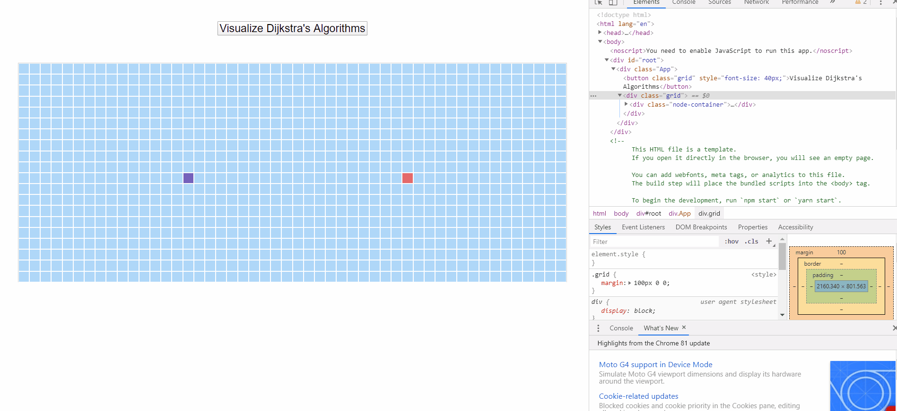

# dijkstra-visualizer

This project was bootstrapped with [Create React App](https://github.com/facebook/create-react-app).

This project aims to visualize the prozess of dijkstra algorithm on a bunch of grids, it's good practise for javascript and react beginners. Final effect as following:

